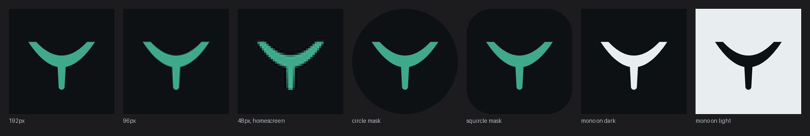

# Brand

## The mark

A hull seen end-on, with the keel hanging below it.



The name is the reason. A keel is the fin under the hull that keeps a boat upright and
tracking straight, which is the whole claim the app makes. The more obvious drawing, the bow
cutting forward, was considered and rejected: it says speed where the name says stability,
and in profile it is asymmetric, which Android punishes.

## Why symmetric

Android adaptive icons are masked by the launcher into a circle, a squircle, a rounded
square or a teardrop, and the app does not get to choose. An asymmetric mark is cropped
differently on every phone. This one is symmetric about the vertical axis, so every mask
produces the same result. Android 13 and later also render a themed icon from a single flat
silhouette, so the mark is one closed shape with no strokes, no gradient and no second
colour.

`brand/keel-icon-tests.png` is generated, not drawn. It is the actual mark at 192, 96 and
48px, under both masks, and in monochrome on dark and light. Regenerate it after any change
to the geometry and look at it before committing:

```
python tools/render_brand.py
```

48px is the size that matters, because that is roughly what a home screen shows. Any change
that is only checked at 512 is not checked.

## Geometry

Drawn on the 108dp adaptive-icon grid, entirely inside the 72dp safe zone (18 to 90).

| | |
|---|---|
| Deck line | y 34 |
| Beam | x 20 to 88 |
| Draft | 26, to y 60 |
| Wall thickness | 12 |
| Blade | y 52 to 80, tapering 9 to 6, rounded tip |
| Occupied | x 20 to 88, y 34 to 83 |

The hull is a shell of roughly constant wall thickness, not a wedge, and it terminates in a
flat deck edge at each end rather than a point. Both details exist because the earlier
versions failed without them: a constant-weight arc with a centre stroke read as a tuning
fork, and a wedge that tapered to knife points read as a leaf and lost its ends at 48px.

`brand/keel-mark.svg` is the source of truth. `tools/render_brand.py` holds the same
geometry as numbers and produces the PNGs. If the two ever disagree, the SVG wins.

## Colour

The mark is `#3FA98B` on `#0E1114`, the same accent and surface as the app, and it is never
recoloured. The monochrome variant uses `currentColor` and inherits.

## Files

| File | Use |
|---|---|
| `brand/keel-mark.svg` | The mark alone, transparent. Source of truth. |
| `brand/keel-mark-mono.svg` | Single colour via `currentColor`, for themed icons. |
| `brand/keel-icon.svg` | Mark on the app ground, for the launcher icon. |
| `brand/keel-512.png` `keel-192.png` `keel-96.png` `keel-48.png` | Raster renders. |
| `brand/keel-icon-tests.png` | The mask and size checks above. |

## Wordmark

Not yet drawn. When it is: Roboto Flex, tight tracking, lowercase, and the mark sits to the
left at cap height. Nothing decorative between them.
