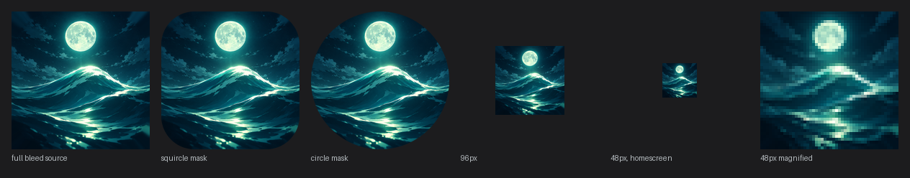
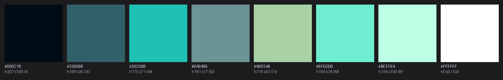

# Brand

## The icon



A full moon over a single swell at night. Generated art, chosen for the mood rather than for
symbolic cleverness, and it does the one job an icon has: at 48px the moon and the lit crest
still read, which is more than most detailed icons manage.

`brand/tide-icon-source.png` is the master. It is a **full-bleed 1024 square with square
corners**, deliberately: Android adaptive icons are masked by the launcher into a circle, a
squircle, a rounded square or a teardrop, and handing the system a pre-rounded image
double-rounds it. The original render arrived inside a rounded presentation card, so the card
was cropped out and the corners were rebuilt by projecting the artwork outward along the
corner arc, then softened so the projection leaves no streaks.

Everything else is generated from that one file:

```
python tools/render_brand.py
```

It writes the raster sizes, the mask and size test sheet above, and the palette sheet below.
Run it and look at the sheet after any change to the artwork. 48px is the size that decides.
A mark checked only at 512 is not checked.

## The palette comes from the icon



The theme is not chosen next to the icon, it is quantised out of it. `surface` is the
artwork's deep water, `accent` is its wave glow. That is why the two cannot drift apart, and
why re-running the generator after an art change is not optional. Values and measured
contrast ratios live in [design-system.md](design-system.md).

## What this replaced, and why

The app was called Keel first, and the mark was a keel drawn as flat vector geometry. It went
through six versions and every one failed the same way: a hull with a fin below it is a
horizontal element over a vertical stem over a base, which is structurally a table. The
variants read in turn as a tuning fork, a leaf, a goblet, a shot glass and a champagne coupe.
Tuning proportions never escaped it, because the silhouette family itself is furniture. An
image model asked for the same thing produced a literal table, for the same reason.

The name changed to Tide and the mark became a tide curve against a chart datum, which worked
but was cold. It was replaced by this artwork.

Two things worth keeping from that:

- **A name whose referent cannot be drawn is a liability** for something that needs a home
  screen icon. Drawability belongs in the naming round, not downstream of it.
- **Image models are bad at flat geometric marks and good at atmospheric imagery.** Asking
  one for a minimal two-colour vector logo wastes generations. Asking one for a moonlit sea
  works first time. Use each for what it is good at.

## Files

| File | Use |
|---|---|
| `brand/tide-icon-source.png` | Master artwork, 1024, full bleed, square corners. |
| `brand/tide-512.png` `tide-192.png` `tide-96.png` `tide-48.png` | Raster sizes. |
| `brand/tide-icon-tests.png` | Mask and size checks. Generated. |
| `brand/tide-palette.png` | Palette sampled from the artwork. Generated. |

## Still to do

- A monochrome silhouette for Android 13+ themed icons. Detailed artwork cannot supply one,
  so this needs a simple derived glyph, probably the moon and crest reduced to two shapes.
- A wordmark.
- The splash screen and the in-app depth gradient, both derived from this artwork.
