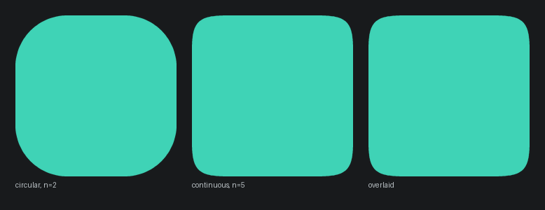
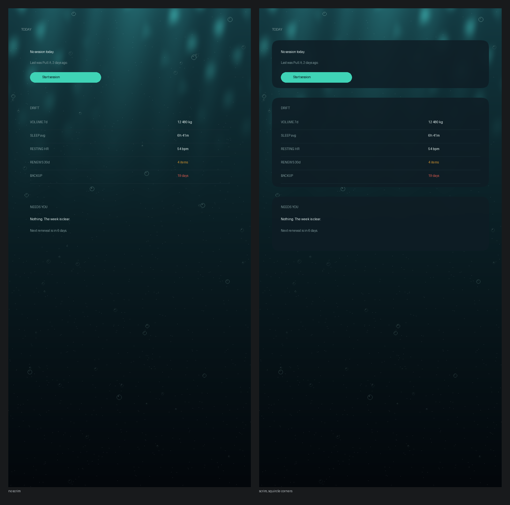

# Tide design system

The rules the code is checked against. If a screen disagrees with this file, one of the two
is wrong, and this file is the one that gets amended on purpose.

## Direction

An instrument panel, not a scrapbook. Precise, quiet, legible at arm's length in bad light,
and honest when the reading is boring.

The version of this app that writes itself is a 2x3 grid of identical gradient stat cards
with ring charts and a "Good morning" header. Every rule below exists to prevent that.

## Colour

Dark is the design target. Light is a full peer, not an afterthought.

| Token | Dark | Meaning |
|---|---|---|
| `surface` | `#071016` | Deep water. Off-black with a blue-green cast. Never `#000000`. |
| `surfaceRaised` | `#0E1C24` | Sheets, the one card type. |
| `hairline` | `#1B3038` | 1dp separators. The main grouping device. |
| `textPrimary` | `#E4F2F0` | |
| `textMuted` | `#7F9A9C` | Labels, units, secondary values. |
| `accent` | `#3FD3B6` | Wave glow. |
| `warning` | `#D2952F` | Expiring, stale, due soon. Nothing else. |
| `critical` | `#E05A4E` | Overdue, failed, over budget. Nothing else. |

**Sampled from the icon, not invented.** `tools/render_brand.py` quantises
`brand/tide-icon-source.png` and writes `brand/tide-palette.png`. The surface is the artwork's
deep water, the accent is its wave glow. Theme and icon cannot drift apart because one is
derived from the other. Re-run it after any change to the artwork.

Measured contrast against `surface`, WCAG AA needs 4.5 for body text:

| | ratio | |
|---|---|---|
| `textPrimary` | 16.7 | AA |
| `accent` | 10.2 | AA |
| `warning` | 7.4 | AA |
| `textMuted` | 6.4 | AA |
| `critical` | 5.3 | AA |

**One accent, whole app, no user picker.** The accent is not decoration. It marks the one
thing on a screen that the user is most likely to act on, so a screen with two accent
elements usually has a hierarchy problem rather than a colour problem.

**Red never decorates.** If something is red, something is wrong. Amber means expiring or
stale, nothing else.

Hex literals live in `:core:design` and nowhere else. A grep in CI enforces it.

## Type

Two families, one rule each.

- **Roboto Flex** for all text. It is the system variable font and what the Material 3
  Expressive type scale is built on. Replacing it costs locale coverage and rendering quality
  and buys very little.
- **IBM Plex Mono** for every numeral, unit and data label, with tabular figures enabled.
  Weights change, columns do not.

That second rule is most of the instrument-panel feel. A number rendered in the body font is
a bug.

## Shape: continuous corners

Corners are **superellipse, not circular arcs**. A circular corner meets the straight edge
with a sudden jump in curvature, and the eye reads that discontinuity as slightly cheap even
when it cannot name it. A continuous corner ramps the curvature in, which is most of why iOS
surfaces feel more considered than Android ones.

Compose's `RoundedCornerShape` is circular. `:core:design` provides
`ContinuousCornerShape(radius, n = 5f)`, a custom `Shape` building the superellipse path
`|x/r|^n + |y/r|^n = 1`. Applied once through `MaterialTheme.shapes` so every Material
component inherits it.

| Element | Radius | n |
|---|---|---|
| Panels and sheets | 20dp | 5 |
| Inputs | 12dp | 5 |
| Chips and buttons | full pill | pill is unaffected |
| Bottom sheets | 28dp top corners | 5 |

Continuous corners need a larger radius than circular ones to read as intentional, which is
why panels moved from 12dp to 20dp. Two caveats worth knowing: a custom `Shape` builds a
`Path` rather than a fast rounded-rect, so it is marginally more expensive (irrelevant at
these counts, measure if a list ever stutters), and a handful of Material components hardcode
their shape and will need wrapping.

## The ocean

The ground is not a flat colour. It is deep water: a depth gradient, light shafts near the
surface, caustics, suspended particulate and slow bubbles, going black as you descend. The
left panel above is content sitting directly on it. The right is the shipped arrangement.

**The rule that makes it work: the ocean is never behind a number.** Every surface carrying
text or data sits on a scrim, `surfaceRaised` at about 84 percent over a blurred backdrop,
with continuous corners. You see the water in the gaps, behind the top bar, in empty states
and down the margins, and never through a reading. Contrast ratios in the colour section are
measured against the scrim, not against the water, and that is the number that must hold.

**Scroll is descent.** Scrolling down darkens the ground and drifts the particulate upward.
This is the one piece of background motion that survives the frequency gate, because it
communicates position in a long list rather than decorating.

**Honest conflict, and how it resolves.** The motion section says no perpetual ambient
animation on a surface opened twenty times a day, and an animated ocean is exactly that. The
resolution is that the ocean is environment rather than feedback, so it is held to a
different standard: it moves slowly enough to be ignorable, it stills wherever content is
dense, and it is never the thing that tells you something changed. Where that is not enough,
it turns off:

- Off under `prefers-reduced-motion`, battery saver and power save.
- Off entirely on the active session logger. Mid-workout you do not need bubbles.
- A setting with three values: Full, Subtle (gradient only, no animation), Off (flat
  `surface`). Subtle is the default on devices reporting low RAM.

**Implementation.** An AGSL `RuntimeShader` on API 33+, which keeps the whole thing on the
GPU as one draw. Below 33, a pre-rendered gradient plus a static caustic texture, no
animation. `tools/render_mock.py` holds the reference implementation of the look in Python
and regenerates the image above; the shader has to match it, and that image is the target.

## Materiality

Cards only where elevation means "this is a separate tappable thing". Inside a card, groups
are separated by 1dp hairlines and negative space, never by nested cards. Density is high on
purpose: numbers breathe in plain layout, they do not each get a box.

## Motion

Weighted for a mobile app: production polish first, restraint second, delight rationed. The
frequency gate decides every case.

| Surface | Frequency | Motion |
|---|---|---|
| Today | 20+ per day | **None on entry.** Content is present at the first frame. |
| Into a module | many per day | Container transform and predictive back, 250ms, emphasized easing |
| Logging a set | 100s per session | **Zero.** State change and a 60ms haptic tick. |
| Adding a commitment | monthly | Standard sheet motion, 300ms |
| Milestone or PR | rare | Expressive, once, never blocking, dismissible |
| Weekly review | weekly | A real staged reveal |
| Birthday | yearly | Expressive. One plain sentence, no confetti. |

Before adding any animation, answer in one sentence what it communicates: hierarchy,
storytelling, feedback, or state transition. "It looked good" is not one of the four.

Everything degrades under reduced motion. Check both `ANIMATOR_DURATION_SCALE == 0` and
`AccessibilityManager.isReduceMotionEnabled`, wrapped once as `rememberReducedMotion()` in
`:core:design` so no feature module has to remember.

## Notifications

Nothing posts a notification directly. Everything goes through `:core:notify`, declares a
tier, and the tier decides channel, sound, quiet-hours behaviour and bundling. A lint rule
forbids `NotificationManagerCompat` imports outside that module.

| Tier | Behaviour |
|---|---|
| `Ambient` | Silent, collapsed into one daily digest, always visible in Inbox |
| `Timely` | Own notification, no sound, respects quiet hours |
| `Demanding` | Heads-up with sound, respects quiet hours |
| `Critical` | Breaks quiet hours. The only tier that does. |

Tide is a notification-heavy app on purpose, so the discipline has to be somewhere. It is
here: the failure mode is not volume, it is uniform volume, which teaches people to swipe
without reading. Settings keeps a ledger of every notification posted and whether it was
opened or dismissed, with a one-tap demote, because a source you always dismiss should be
visible as such rather than silently tolerated.

**Ask only what the database cannot answer.** A confirmation prompt that fires when a logged
session already answers it is a bug, not a reminder.

## Copy

- English only on screen.
- No streaks, no flames, no guilt. A missed day is a fact and the copy states it as one.
  Nothing in this app scolds.
- No em dashes and no en dashes. Anywhere. A hyphen, a comma, a period, or rewrite it.
- No invented precision. A number is either real, or labelled as sample data, or absent.
- No emoji in the interface.
- Empty states are written before the populated ones and say plainly that there is nothing,
  rather than inventing filler to fill the space.
- Read every string in `strings.xml` aloud before shipping. It catches the copy that sounds
  thoughtful and means nothing, which no grep will.

## Home screen

A vertical priority stack, not a grid, and its shape changes across the week.

1. One status line in plain language, mono numerals inline. Not a greeting.
2. **Needs you.** Variable height, empty most days, and honest about it.
3. **Today.** The scheduled session, or a plain statement that there is none.
4. **Drift.** A hairline-separated strip of four to six numbers with sparklines, no boxes.
5. One asymmetric tile for whatever is live this week.

The review card appears only on review day. The app changing shape across the week is the
point.

Navigation is a bottom bar of five: Today, Training, Body, Money, Ask. Inbox is a counted
icon in the Today top bar. Review is not a destination, it arrives.

## Gate before shipping

Run it as a script, not as a good intention.

- Zero en dash (U+2013) and em dash (U+2014) in `app/src`. Build the pattern with bash
  ANSI-C quoting from the codepoints rather than pasting the characters, so the gate script
  does not match itself. The `grep -P '\x{2013}'` form is wrong here: it errors on Git for
  Windows and, because the error exits non-zero, a naive `&&` chain reports a false pass.
  The gate ships with a control case that plants a dash in a temp file and asserts the check
  still catches it, so a blind gate fails loudly instead of passing quietly.
- Zero hex colour literals outside `:core:design`.
- Screenshot tests pass in both themes at `fontScale` 1.0 and 1.5.
- The whole suite passes with the device in airplane mode.
- Every visible string read once, aloud.
